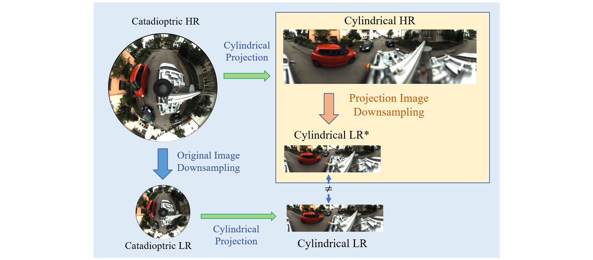
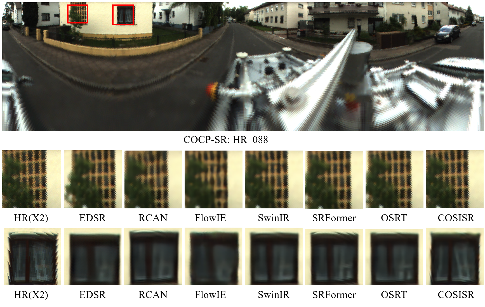

# (The Visual Computer) Adaptive Super-Resolution Framework for Catadioptric Omnidirectional Images via Cylindrical Projection and Latitude-Aware Networks
Jiaxu Zhang, Yaowen Lv, Yuxuan Wang, Xu Zhu, Yiming Hu

>Changchun university of science and technology

---

## Introduction

### General Framework for Catadioptric ODISR
Due to the unique circular structure of catadioptric ODIs, feature learning for SR network becomes particularly challenging. To address this issue, a more suitable and general framework for ODISR is proposed. This framework consists of four main components:

1. Construction of the projection model.

2. Generation of datasets for segmented training.

3. Design of the catadioptric ODISR network.

4. Formulation of the segmented training strategy.

### Cylindrical Projection Model
>Due to the unstructured nature of the data in catadioptric ODIs, the learning process of deep learning networks is hindered. By analyzing the imaging process of the catadioptric camera and applying the principle of reversible light paths, we propose using cylindrical projection to unfold the catadioptric omnidirectional image, and the resulting cylindrical unfolded image has a similar structure to the conventional image, which is used as the learning object of the SR network. We provide the complete implementation code for cylindrical projection and downsampling in the file data_preparation.
<p align="center">
  
</p>

### Datasets for Segmented Training
We generated two datasets: Projection Image Dataset (COCP-SR) and Simulation Dataset (SIM-SR).
>The structural characteristics of catadioptric ODIs result in significant stretching of the image near the inner ring during the projection process. As a result, both HR and LR images in the projection image dataset exhibit projection distortions that vary with latitude. Therefore, training solely on the projection image dataset is insufficient to correct these distortions. 
<p align="center">
  
</p>

>Since the projection model represents the inverse of the imaging process, plain images can be used in place of HR images. By applying inverse projection, corresponding catadioptric ODIs and LR images can be generated. The resulting simulated dataset, which contains undistorted HR images, not only facilitates training for projection distortion correction but also overcomes the limitations of insufficient information in catadioptric ODIs. 
<p align="center">
  
</p>

### COSISR
>We propose the first single image super-resolution network for catadioptric omnidirectional images (COSISR). To address the multi-dimensional distortion characteristics of catadioptric images that vary with latitude, we integrated a distortion map learning mechanism into our network architecture. Specifically, COSISR incorporates a dedicated Distortion Feature Extraction Block (DFEB), which learns multidimensional distortion features from distorted maps. Additionally, to capture distortion features that vary with latitude, COSISR introduces two latitude-adaptive feature extraction modules: the Distortion Multi-head Cross-attention Block (DMCB) and the Multi-level Feature Fusion Block (MFFB). The DMCB employs a cross-attention mechanism to learn the correspondence between multidimensional distortions and geometric features in the cylindrical projected images. MFFB employs multi-group mechanism to achieve the fusion and filtering of multi-level features. Experimental results show that, owing to the synergistic contributions of each component within the framework for catadioptric ODISR, COSISR outperforms existing image SR algorithms, achieving state-of-the-art performance.
<p align="center">
  
</p>

### Segmented training strategy
We divide the training of the SR network into two stages: 

>first, the projection dataset COCP-SR is used for standard training to learn basic image features.
<p align="center">
  
</p>

>second, the simulation dataset SIM-SR is employed for corrective training to learn projection distortion features and restore missing image details.
<p align="center">
  
</p>

---

## Environment
- [PyTorch >= 1.7](https://pytorch.org/)
- [BasicSR](https://github.com/XPixelGroup/BasicSR/blob/master/INSTALL.md) 
#### Installation
```
pip install -r requirements.txt
```

## Data Preparation
> We propose a cylindrical projection model for transforming the data structure of catadioptric omnidirectional images.Based on this model, we generated a projection image dataset COCP-SR and a simulation dataset SIM-SR.
1. COCP-SR is generated from the publicly available dataset [Omnicam](https://www.cvlibs.net/projects/omnicam).
```bash
mkdir datasets
ln -s YOUR_LAU_DATASET_PATH COSISR/datasets/data
```
2. Image size correction.
```bash
python Data_preparation/img_reset.py
```
3. SIM-SR is generated from the publicly available dataset [DF2K](https://opendatalab.org.cn/df2k_ost).
```bash
ln -s YOUR_DIV2K_TRAINSET_PATH COISR/datasets/DIV2K_train_HR
ln -s YOUR_DIV2K_TRAINSET_PATH COISR/datasets/DIV2K_valid_HR
ln -s YOUR_FLICKR2K_TRAINSET_PATH COISR/datasets/Flickr2K_HR
```
4. Cylindrical projection
```bash
python Data_preparation/create_data_lists.py
python Data_preparation/cylindrical_projection.py
```
5. Crop training patches （COCP-SR and SIM-SR）
```bash
python Data_preparation/sub_image.py
```

## Training
1. Standard Training
We provide standard training options of COSISR-full and COSISR-light on X2 and X4 SR.

Training COSISR and other baseline models:
```bash
CUDA_VISIBLE_DEVICES=0,1,2,3 python -m torch.distributed.launch --nproc_per_node=4 --use_env train.py -opt ./options/train/*.yml --launcher pytorch
```

2. Correction  Training
We provide correction training options of COSISR-sim on X2 and X4 SR.
```bash
CUDA_VISIBLE_DEVICES=0,1,2,3 python -m torch.distributed.launch --nproc_per_node=4 --use_env train.py -opt ./options/train/*_sim.yml --launcher pytorch
```

## Testing 
Pretrained models can be downloaded [here](https://drive.google.com/drive/folders/1xd-xbRPwDeLVOq7qunlgIOxIJeJByfoi?usp=sharing).

1. Testing of Standard Training. The results are displayed in the file fig/X2 and fig/X4
```bash
ln -s YOUR_PRETRAIN_MODEL_PATH pretrained_models
CUDA_VISIBLE_DEVICES=0 python test.py -opt ./options/test/*.yml
```

2. Testing of Correction Training. The results are displayed in the file fig/COSISR_X2_sim and fig/COSISR_X4_sim
```bash
ln -s YOUR_PRETRAIN_MODEL_PATH pretrained_models
CUDA_VISIBLE_DEVICES=0 python test.py -opt ./options/test/*_sim.yml
```

## License and Acknowledgement
This project is released under the MIT license. The codes are heavily based on [BasicSR](https://github.com/XPixelGroup/BasicSR). Please also follow their licenses. Thanks for their awesome works.
